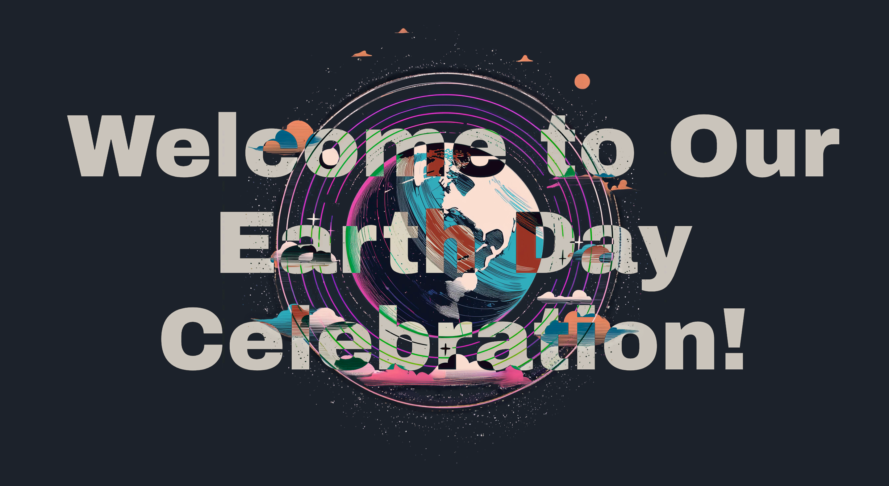
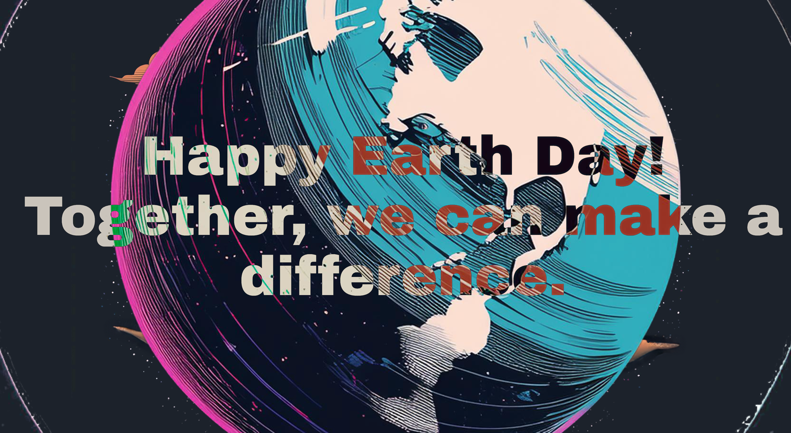

_This is a submission for [Frontend Challenge v24.04.17](https://dev.to/devteam/join-us-for-the-next-frontend-challenge-earth-day-edition-52e4), Glam Up My Markup: Earth Day Celebration Landing Page_

## What I Built

My main goal was to create unusual aesthetic. I was inspired by neo-brutalism, Y2k and a little bit of Furiger Aero. I tried to mix and match until I found something what I believe is visuallly appealing.
I pruerly used css and a little bit of js, I had to sacrifes a lot of readability, but I think it was worth it.

I hope you like it as well!

## Demo

## Journey

My process was simple, googling some inspirations, trying to recreate them and then mix and match until I found something I liked. I also used a lot of clip-paths and css filters, I really like how the contrasting text interacts with the background illustration.

I used Adobe Firefly to generate the background illustration, than I separeated into multiple layers using photoshop.

I had to use requestAnimationFrame to make the scrolling animations smooth, as using only the scoll events felt choppy.

Overall I'm happy with the result, and it was a fun couple of hours.
